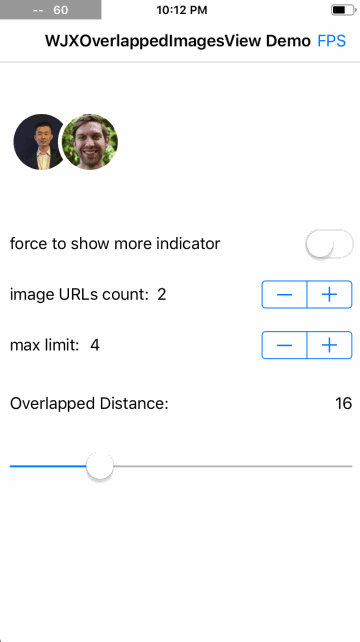

# WJXOverlappedImagesView

WJXOverlappedImagesView is a very simple and common view made up of a group of round-cornered image views whitch over lapped on each other with some distance. There is no much deep technology but a common encapsulation. I'm glad that if you will like it or even give it a star.



## Installation

### CocoaPods
WJXOverlappedImagesView is available through [CocoaPods](http://cocoapods.org). To install it, simply add the following line to your Podfile, and then `import WJXOverlappedImagesView`:

```ruby
pod 'WJXOverlappedImagesView', '0.0.1'
```

### Manually

1. Download the project and drop `WJXOverlappedImagesView` folder into your project;

## How to use

Within a simple and effective clourse `updateInTransaction` you can apply a custom color and width for the border of its image view, a same width for each image and the overlapped distance and so on.

```swift
overlappedImagesView.updateInTransaction { imagesView in
    imagesView.imageBorderWidth = 4
    imagesView.imageBorderColor = UIColor.white
    imagesView.imageHeight = 66
    imagesView.overlapDistance = 16
    imagesView.shouldShowMoreIndicatorImageViewWhenImageCountExceedsMaxLimit = true
    imagesView.maxLimit = 4
    imagesView.imageUrls = ["https://avatars1.githubusercontent.com/u/4176744?v=40&s=132",...]
}
```

It's flexible to customize the way to fetch images. It does not depend on any 'WebImage' framework by opening a imageFetcher:

```swift
overlappedImagesView.imageFetcher = { imagesView, imageView, url, index in
    // fetch image via Kingfisher
    imageView.kf.setImage(with: URL(string: url), placeholder: UIImage(named: "demo-avatar"))

    // fetch image via YYWebImage
    // imageView.yy_setImage(with: URL(string: url)!, placeholder: UIImage(named: "demo-avatar"))
    
    // fetch image via SDWebImage
    // imageView.sd_setImage(with: URL(string: url), placeholderImage: UIImage(named: "demo-avatar"))
}
```

Sometimes it's necessary to cancel the image loading, if it is a subview of some reusable view, such as cell, when it'll be reused. Here is the cancler:

```swift
overlappedImagesView.imageFetchCanceler = { imagesView, imageView, index in
    imageView.kf.cancelDownloadTask()
    // imageView.yy_cancelCurrentImageRequest()
    // imageView.sd_cancelCurrentImageLoad()
}
```

You don't need to calculate the width. It is support for intrinsicContentSize.

```swift
overlappedImagesView.frame = CGRect(x: 0, y: 0, width: overlappedImagesView.intrinsicContentSize, height: imageHeight)
```

## Author
**Jiuxing Wang** *email: [wangjiuxing2010@hotmail.com](mailto:wangjiuxing2010@hotmail.com)*

## License
WJXOverlappedImagesView is released under MIT license. See LICENSE for details.
